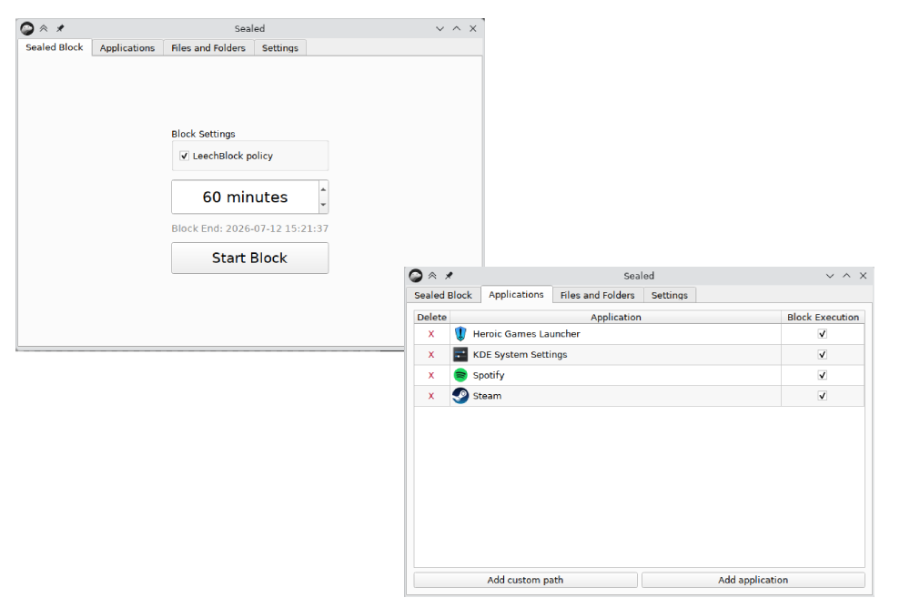
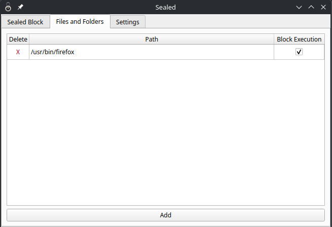

# Changelog

## 4.1 - 2026-07-12

### Added

- Now application blocking follows a completely separate logic than File/Folders.
- Added a GUI section for application blocking.
- Removed the File/Folder and Applications global toggle. Now on every block session all apps and folders marked for blocking will be blocked.

### Fixes

- Now file explorer picker starts in user Home.
- Added a security check that prevents to block Sealed's executable.

## 4.0 - 2026-06-30

### Added

- Implemented a GUI, now you can run Sealed directly from your favorite application launcher.
  It's pretty minimalistic, since I've never create a GUI app, but I think it's a good wrapper for the terminal commands.
  
  
  
- Added `--uninstall` command, this will wipe every file related to Sealed


## 3.2 - 2026-06-28

### Added

- Now blocking the execution of a binary will also kill the process when a block is started.
- Now you can block the execution of a binary when already inside a block (and the process will also be killed), even if it was already added to the list of files to be blocked but without the "--block-exec" flag. I.e. you can do:
  ```
  sudo sealed --add-files-folders /usr/bin/steam
  sudo sealed --add-files-folders /usr/bin/steam --block-exec
  ```
  in case you forgot the `--block-exec` on the first run of the command.

## 3.1 - 2026-02-06

### Fixed

- Fixed a bug where files immutability wouldn't properly restore due to folders with symlinks like Python virtual environments.
- If the file/folders to block list point to a file/folder that do not exist anymore then it will be removed from the list.

## 3.0 - 2026-02-06

### Added

- Core mechanics completely rewritten in order to be more stable.
- Barebone log display in terminal at every command run.
- Now you can run directly from terminal by typing `sudo sealed`.
- From now on there will be two ways to run the app: cli and GUI. For the moment CLI is implemented, GUI has just to be updated to use the new code for core mechanics.
- You can add exceptions to `sudo` commands, for example you can block everything but `sudo pacman -S *`.
- Now you can block file and folders both from being modified and from being executable. 
  - Block a file/folder from being modified (this prevents you from editing certain files): `sudo sealed --add-file-folder "/path/to/file/folder`
  - You can also block a certain executable file from being launched: `sudo sealed --add-file-folder "/usr/bin/steam --no-exec`
  - You can run this command also during a block!
  - If you want to stop blocking certain files folder, just edit `/usr/local/bin/sealed_src/file_folders.json`. Of course you have to do that outside of a block session.

### Changed

- The blocking mechanics does not rely on groups anymore but solely on `sudoers.d` files. This allows a more flexible approach and most importantly: you don't need to log-out anymore in order to make the block effective, before this every time a block is started the used needed to log-out in order to reload the groups memberships.
- I'm not using classes anymore, the code is more functional-oriented.

### Removed

- Removed the UI for the moment as the focus is in having a more robust core mechanic of the blocking.
- Removed websites blocking for the moment, it will be added again soon.


## 2.0 - 2026-02-02

- Completely rewritten the code to be more robust across various distros.
- Now the script checks that `at` service is running every time before blocking.
- The script checks every time that permissions and groups are configured properly.
- New interface using `ttkbootstrap`.
- Allows to:
  - Block `sudo` access by removing user from `wheel` group
  - Block `su` access
  - Block websites by modifying `/etc/hosts`
  - Block file/folders by making them immutable